# Dna.Agent 类图

> 状态：目标类图
> 最后更新：2026-04-04
> 适用范围：`src/Dna.Agent`

本文档描述 `Dna.Agent` 的目标职责边界。  
它只关心需求拆解后的任务编排与执行，不直接承载知识域实现。

## 目标类图

```mermaid
classDiagram
    class IAgentRuntimeService {
        <<interface>>
        +StartSessionAsync(request, cancellationToken) AgentSessionState
        +GetSession(sessionId) AgentSessionState
        +CancelSessionAsync(sessionId, cancellationToken) bool
        +ListSessions() IReadOnlyList~AgentSessionState~
    }

    class IAgentPlanner {
        <<interface>>
        +BuildPlanAsync(request, resolution, cancellationToken) AgentPlan
    }

    class IAgentExecutor {
        <<interface>>
        +ExecuteAsync(session, plan, cancellationToken) AgentExecutionResult
    }

    class IToolCallCoordinator {
        <<interface>>
        +InvokeAsync(request, cancellationToken) ToolCallResult
    }

    class IAgentModelGateway {
        <<interface>>
        +RunAsync(prompt, cancellationToken) AgentModelResponse
    }

    class IWorkbenchFacade {
        <<interface>>
    }

    class WorkbenchRequirementResolutionResult
    class WorkbenchTaskStartRequest
    class WorkbenchTaskContext
    class WorkbenchTaskResult

    class AgentTaskRequest {
        +string Title
        +string Objective
        +Dictionary~string,string~ Metadata
    }

    class AgentSessionState {
        +string SessionId
        +string Status
        +DateTime StartedAtUtc
        +DateTime UpdatedAtUtc
        +AgentTaskRequest Task
        +AgentPlan Plan
    }

    class AgentPlan {
        +List~AgentPlanStep~ Steps
        +string Summary
    }

    class AgentPlanStep {
        +string StepId
        +string Title
        +string Description
        +string Status
        +string TargetModuleId
        +IReadOnlyList~string~ PredecessorStepIds
    }

    class ToolCallRequest {
        +string ToolName
        +Dictionary~string,object~ Arguments
    }

    class ToolCallResult {
        +bool Success
        +string Content
        +Dictionary~string,object~ Metadata
    }

    class AgentExecutionResult {
        +string SessionId
        +string Status
        +string Output
        +IReadOnlyList~string~ CompletedTaskIds
    }

    class AgentModelResponse {
        +string Content
        +bool Completed
    }

    IAgentRuntimeService --> AgentTaskRequest : consumes
    IAgentRuntimeService --> AgentSessionState : returns
    IAgentRuntimeService --> IAgentPlanner : uses
    IAgentRuntimeService --> IAgentExecutor : uses
    IAgentRuntimeService --> IWorkbenchFacade : depends on

    IAgentPlanner --> AgentTaskRequest : consumes
    IAgentPlanner --> WorkbenchRequirementResolutionResult : consumes
    IAgentPlanner --> AgentPlan : returns

    IAgentExecutor --> AgentSessionState : consumes
    IAgentExecutor --> AgentPlan : consumes
    IAgentExecutor --> AgentExecutionResult : returns
    IAgentExecutor --> WorkbenchTaskStartRequest : creates
    IAgentExecutor --> WorkbenchTaskContext : consumes
    IAgentExecutor --> WorkbenchTaskResult : writes
    IAgentExecutor --> IToolCallCoordinator : uses
    IAgentExecutor --> IAgentModelGateway : uses
    IAgentExecutor --> IWorkbenchFacade : uses

    AgentPlan *-- AgentPlanStep : contains
    IToolCallCoordinator --> ToolCallRequest : consumes
    IToolCallCoordinator --> ToolCallResult : returns
    IAgentModelGateway --> AgentModelResponse : returns
```

## 类图说明

- `IAgentRuntimeService`
  - 内置 Agent 的总入口
  - 管理任务生命周期与会话状态
- `IAgentPlanner`
  - 消费 Workbench 提供的需求拆解结果
  - 决定如何形成真正执行计划
- `IAgentExecutor`
  - 负责驱动执行循环
  - 通过 Workbench 的 `startTask / endTask` 管理模块级任务闭环
- `IToolCallCoordinator`
  - 负责把工具调用统一收口
- `IAgentModelGateway`
  - 负责大模型交互
- `IWorkbenchFacade`
  - Agent 不直接碰底层知识实现，只通过 Workbench 获取项目能力与任务上下文

## 关键边界

后续实现时应坚持：

1. `Dna.Agent` 只依赖 `Dna.Workbench`，不反向依赖 `Dna.Knowledge`
2. 需求拆解支持、任务上下文、模块租约都属于 `Dna.Workbench`
3. `Dna.Agent` 只决定任务编排顺序，不生成越权上下文
4. 工具调用策略在 `Dna.Agent`，工具能力定义与项目能力面在 `Dna.Workbench`
5. 运行时事件由 `Dna.Agent` 产生，再写入 `Dna.Workbench` 的运行时观测入口
