# Dna.ExternalAgent 类图

> 状态：目标类图
> 最后更新：2026-04-04
> 适用范围：`src/Dna.ExternalAgent`

## 模块定位

`Dna.ExternalAgent` 负责把外置 Agent 产品差异，收敛到统一的拓扑治理、任务闭环和配置打包模型。

## 目标类图

```mermaid
classDiagram
    class IExternalAgentIntegrationService {
        <<interface>>
        +ListAdapters() IReadOnlyList~ExternalAgentAdapterDescriptor~
        +BuildPackage(request) ExternalAgentPackageResult
    }

    class IExternalAgentAdapterCatalog {
        <<interface>>
        +ListAdapters() IReadOnlyList~ExternalAgentAdapterDescriptor~
        +FindAdapter(productId) IExternalAgentAdapter
    }

    class IExternalAgentAdapter {
        <<interface>>
        +ExternalAgentAdapterDescriptor Descriptor
        +BuildPackage(context) ExternalAgentPackageResult
    }

    class ExternalAgentAdapterDescriptor {
        +string ProductId
        +string DisplayName
        +string Description
        +string InstallMode
        +IReadOnlyList~string~ Capabilities
        +IReadOnlyList~string~ ManagedPaths
    }

    class ExternalAgentPackageRequest {
        +string ProductId
        +string ServerName
        +string McpEndpoint
        +string WorkspaceRoot
        +bool StrictTopologyMode
    }

    class WorkbenchRequirementResolutionRequest
    class WorkbenchRequirementResolutionResult
    class WorkbenchGovernanceRequest
    class WorkbenchGovernanceResolutionResult
    class WorkbenchTaskStartRequest
    class WorkbenchTaskContext
    class WorkbenchTaskResult

    class ExternalAgentTopologyPolicy {
        +bool RequireRequirementResolution
        +bool RequireModuleResolution
        +bool RequireContainmentNavigation
        +bool RequireDependencyDirectionValidation
        +bool RequireCollaborationValidation
        +bool RequireStartTaskBeforeExecution
        +bool RequireEndTaskAfterExecution
        +bool RequireMemoryWriteBack
        +bool StrictMode
        +IReadOnlyList~string~ RequiredToolNames
        +IReadOnlyList~string~ WorkflowRules
    }

    class ExternalAgentManagedFile {
        +string RelativePath
        +string Content
        +string Purpose
    }

    class ExternalAgentPackageResult {
        +ExternalAgentAdapterDescriptor Adapter
        +ExternalAgentTopologyPolicy Policy
        +IReadOnlyList~WorkbenchToolDescriptor~ RequiredTools
        +IReadOnlyList~ExternalAgentManagedFile~ ManagedFiles
        +IReadOnlyList~string~ Notes
    }

    class ExternalAgentPackageContext {
        +ExternalAgentPackageRequest Request
        +ExternalAgentTopologyPolicy Policy
        +IReadOnlyList~WorkbenchToolDescriptor~ RequiredTools
        +string SharedInstructionsMarkdown
    }

    class CursorExternalAgentAdapter
    class ClaudeCodeExternalAgentAdapter
    class CodexExternalAgentAdapter
    class CopilotExternalAgentAdapter
    class WorkbenchToolDescriptor

    IExternalAgentIntegrationService --> ExternalAgentPackageRequest : consumes
    IExternalAgentIntegrationService --> ExternalAgentPackageResult : returns
    IExternalAgentIntegrationService --> IExternalAgentAdapterCatalog : depends on
    IExternalAgentIntegrationService --> WorkbenchRequirementResolutionRequest : future entry
    IExternalAgentIntegrationService --> WorkbenchRequirementResolutionResult : future resolution
    IExternalAgentIntegrationService --> WorkbenchGovernanceRequest : future governance entry
    IExternalAgentIntegrationService --> WorkbenchGovernanceResolutionResult : future governance scope
    IExternalAgentIntegrationService --> WorkbenchTaskStartRequest : future task start
    IExternalAgentIntegrationService --> WorkbenchTaskContext : future task context
    IExternalAgentIntegrationService --> WorkbenchTaskResult : future task result

    IExternalAgentAdapterCatalog --> IExternalAgentAdapter : resolves
    IExternalAgentAdapterCatalog --> ExternalAgentAdapterDescriptor : returns

    IExternalAgentAdapter --> ExternalAgentAdapterDescriptor : exposes
    IExternalAgentAdapter --> ExternalAgentPackageContext : consumes
    IExternalAgentAdapter --> ExternalAgentPackageResult : returns

    CursorExternalAgentAdapter ..|> IExternalAgentAdapter
    ClaudeCodeExternalAgentAdapter ..|> IExternalAgentAdapter
    CodexExternalAgentAdapter ..|> IExternalAgentAdapter
    CopilotExternalAgentAdapter ..|> IExternalAgentAdapter

    ExternalAgentPackageResult o-- ExternalAgentAdapterDescriptor : aggregates
    ExternalAgentPackageResult o-- ExternalAgentTopologyPolicy : aggregates
    ExternalAgentPackageResult o-- ExternalAgentManagedFile : aggregates
    ExternalAgentPackageResult o-- WorkbenchToolDescriptor : aggregates

    ExternalAgentPackageContext o-- ExternalAgentPackageRequest : aggregates
    ExternalAgentPackageContext o-- ExternalAgentTopologyPolicy : aggregates
    ExternalAgentPackageContext o-- WorkbenchToolDescriptor : aggregates
```

## 类图说明

- `IExternalAgentIntegrationService`
  - 统一对外入口
  - 上层只需要传入产品 ID 和接入请求，即可拿到产品级接入包
- `IExternalAgentAdapterCatalog`
  - 管理所有产品适配器
  - 让新增产品时不需要改动上层调用方式
- `IExternalAgentAdapter`
  - 单个产品的适配器接口
  - 负责把统一拓扑策略和任务闭环翻译成产品自己的配置与指令格式
- `ExternalAgentTopologyPolicy`
  - Agentic OS 对外置 Agent 的硬约束
  - 明确要求先做需求收口辅助，再 `startTask`，最后 `endTask`
- `ExternalAgentManagedFile`
  - 表示某个产品需要被管理或生成的文件产物
- `ExternalAgentPackageResult`
  - 最终接入包结果
  - 同时包含适配器信息、拓扑策略、所需工具与待生成文件

## 设计约束

1. 产品差异只能落在 `Adapter` 内部
2. 拓扑治理规则必须先统一，再翻译成产品格式
3. 外置 Agent 的能力入口必须优先依赖 Workbench 工具能力
4. 外置 Agent 的任务循环必须收口为 `resolve requirement / resolve governance -> start task -> end task`
5. 外置 Agent 可以并行发起多个 task，但目标模块必须严格互斥
6. `Dna.ExternalAgent` 不承担当事编排，只承担外置适配与约束打包
