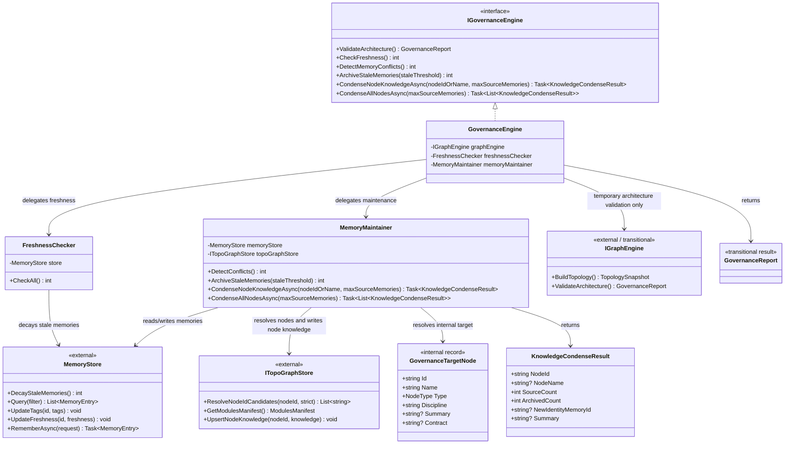

# Dna.Knowledge.Governance 类图

> 状态：目标重构类图
> 最后更新：2026-04-02
> 适用范围：`src/Dna.Knowledge/Governance`

本文档只描述 `Governance` 模块自身的目标类图，以及当前重构中的过渡边界。

## 模块定位

`Dna.Knowledge.Governance` 是知识域中的最上层治理与编排模块。

它不负责：

- `Memory` 的底层存储实现
- `TopoGraph` 的图谱定义与模块注册
- `Workspace` 的事实扫描

它负责：

- 判断记忆是否衰减、冲突或需要归档
- 把短期/长期记忆压缩为稳定的模块知识
- 驱动“记忆 -> 模块知识”的升级过程
- 校验沉淀后的知识是否仍满足架构边界

一句话：

> `Governance` 是知识域里的“治理与演化编排器”。

## 目标类图

下面这张图表达的是 `Governance` 当前应收敛到的主责任分层，而不是把所有实现细节逐文件平铺出来。

## 类图说明

- `IGovernanceEngine`
  - 是治理模块对外暴露的稳定入口
  - App、CLI、MCP 应优先依赖它，而不是依赖治理内部子组件
- `GovernanceEngine`
  - 是治理门面与编排器
  - 自己不承载具体治理算法，只负责把能力路由到子组件
- `FreshnessChecker`
  - 只负责记忆鲜活度衰减
  - 当前已经完全直接消费 `MemoryStore`
- `MemoryMaintainer`
  - 是治理模块的核心工作器
  - 负责冲突检测、归档和模块知识压缩
  - 当前已经直接基于 `MemoryStore + ITopoGraphStore` 工作
- `GovernanceTargetNode`
  - 是治理内部使用的目标节点视图
  - 作用是把 `ModulesManifest` 中的模块注册信息收敛为治理流程真正关心的最小字段集
- `KnowledgeCondenseResult`
  - 是压缩任务的结果模型
  - 对外表达“压缩了哪个节点、用了多少源记忆、归档了多少记忆、生成了哪个 identity 记忆”
- `MemoryStore`
  - 在这里是外部依赖，不属于治理模块
  - 治理只消费它提供的记忆查询、写入和生命周期更新能力
- `ITopoGraphStore`
  - 在这里也是外部依赖，不属于治理模块
  - 治理只使用它做两件事：解析治理目标节点、落模块知识
- `IGraphEngine`
  - 这里只是过渡依赖
  - 当前仅被 `ValidateArchitecture()` 临时使用，不应继续扩散到其他治理路径

## 对当前实现的直接约束

后续继续重构时，`Governance` 应保持下面这些收口方向：

1. `GovernanceEngine` 继续只做门面和编排，不重新吸收具体治理细节。
2. `FreshnessChecker` 继续保持单一职责，只负责鲜活度衰减，不混入冲突检测或知识压缩。
3. `MemoryMaintainer` 继续作为治理主工作器，但只消费 `MemoryStore + ITopoGraphStore`，不重新依赖 legacy `TopologySnapshot`。
4. `ValidateArchitecture()` 是当前唯一保留的 legacy 过渡点；等新的 TopoGraph 校验能力完成后，应移除 `Governance -> IGraphEngine` 这条依赖。
5. `GovernanceTargetNode` 只是治理内部投影视图，不应演化成新的图谱定义入口。
6. `KnowledgeCondenseResult` 只表达治理结果，不承载底层模块知识全文或记忆存储细节。

## 当前过渡态说明

截至 2026-04-02，治理模块的过渡边界如下：

- `CheckFreshness`、`DetectMemoryConflicts`、`CondenseNodeKnowledgeAsync`、`CondenseAllNodesAsync` 已脱离 legacy `TopologySnapshot`
- `ValidateArchitecture` 仍临时委托 legacy `IGraphEngine`
- legacy TopoGraph runtime 仅作为兼容层临时托管在 `TopoGraph/_Deprecated`

因此，这份类图应理解为：

- 主治理链路已经切到新架构
- 架构校验链路仍处于过渡态
