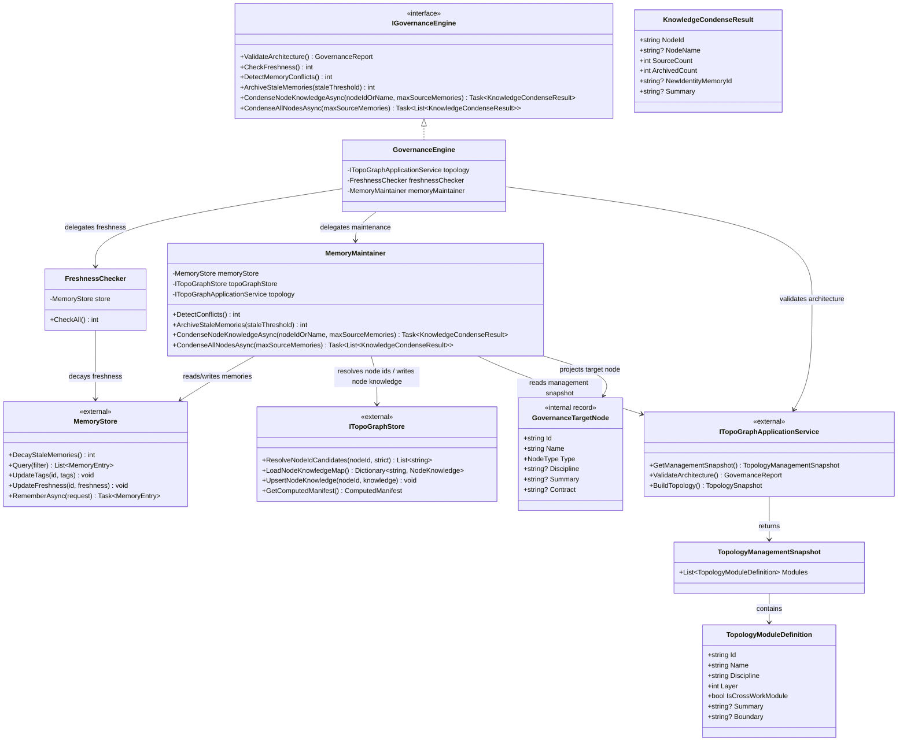

# Dna.Knowledge.Governance 类图

> 状态：重构后类图基线
> 最后更新：2026-04-03
> 适用范围：`src/Dna.Knowledge/Governance`

本文档只描述治理模块当前稳定的责任分层。

## 目标类图

## 类图说明

- `GovernanceEngine` 只做门面和编排。
- `FreshnessChecker` 只负责鲜活度衰减。
- `MemoryMaintainer` 负责冲突检测、归档和知识压缩，但不拥有拓扑定义。
- `ITopoGraphStore` 已收敛为轻量运行时仓库，只承担候选节点解析、计算依赖和节点知识写入。
- `ITopoGraphApplicationService` 是治理读取管理模型与执行架构校验的唯一拓扑入口。
- `GovernanceTargetNode` 是治理内部投影视图，来自 `TopologyManagementSnapshot.Modules`，不是新的注册模型。

## 约束

1. `Governance` 不重新引入图谱定义、模块注册或兼容运行时。
2. `MemoryMaintainer` 必须通过 `GetManagementSnapshot()` 获取治理目标，而不是自行读取定义文件。
3. `ValidateArchitecture()` 只能走 `ITopoGraphApplicationService`。
4. 模块知识沉淀必须回写 `ITopoGraphStore.UpsertNodeKnowledge(...)`。
