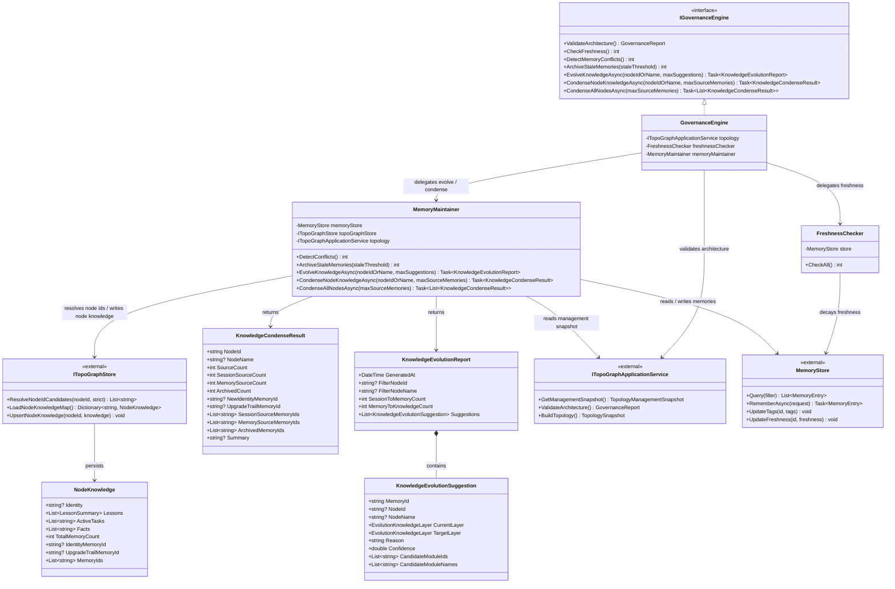

# Dna.Knowledge.Governance 类图

> 状态：重构后稳定类图
> 最后更新：2026-04-03
> 适用范围：`src/Dna.Knowledge/Governance`

## 目标类图

## 说明

- `evolve` 是治理建议接口，只分析升级机会，不直接落库。
- `condense` 是治理执行接口，负责真正生成 identity、upgrade trail，并归档已沉淀记忆。
- `Governance` 不拥有拓扑定义，只消费 `ITopoGraphApplicationService` 与 `ITopoGraphStore`。
- `NodeKnowledge` 已稳定持久化 `IdentityMemoryId` 与 `UpgradeTrailMemoryId`，用于 `.agentic-os/knowledge/modules/<uid>/identity.md` 回写。
