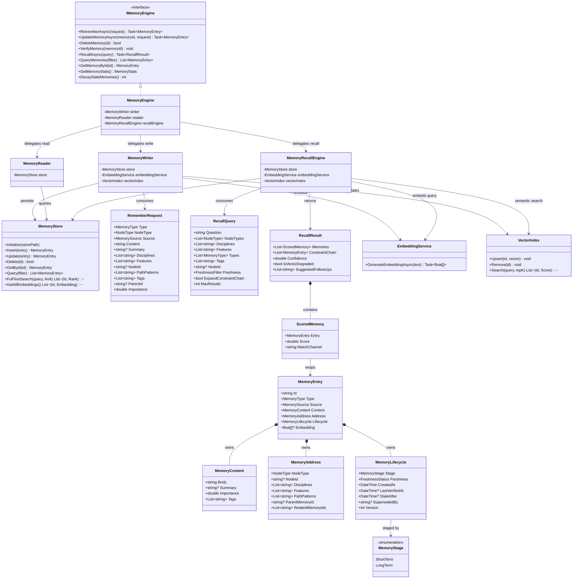

# Dna.Knowledge.Memory 类图

> 状态：目标重构类图
> 最后更新：2026-04-02
> 适用范围：`src/Dna.Knowledge/Memory`

本文档只负责描述 `Memory` 的目标领域类图，不展开整个知识域的架构背景。

## 模块定位

按照当前最新建模口径，`Memory` 在 `Dna.Knowledge` 这个父级 `Department` 中，应视为一个 `TechnicalNode`：

- 它是稳定复用的底层能力模块
- 它对上提供短期记忆与长期记忆的存储、召回与生命周期管理能力
- 它不承担 `TopoGraph` 的结构定义职责
- 它不承担 `TopoGraph` 的最终模块知识存放职责
- 它不承担 `Governance` 的升级裁决职责

一句话：

> `Memory` 是知识域里的“可检索记忆引擎”这个 `TechnicalNode`。

## 目标类图

下面这张类图不是“当前代码逐文件贴图”，而是 `Memory` 接下来重构要收敛到的目标模块类图。

它表达的是：

- 门面、读、写、召回、存储如何分层
- 记忆实体为什么要拆成内容、坐标、生命周期
- 为什么 `MemoryStore` 只能做记忆仓库，不能继续混装 TopoGraph 定义和模块知识

## 类图说明

- `IMemoryEngine`
  - 是 `Memory` 对上层暴露的稳定服务接口
  - App、CLI、MCP 和治理层应优先依赖它，而不是直接依赖底层存储
- `MemoryEngine`
  - 是模块门面
  - 负责把写入、读取、召回三类能力组织为一个统一入口
- `MemoryWriter`
  - 只负责写路径
  - 写前校验、ID 生成、embedding 生成、索引更新都应收口到这里
- `MemoryReader`
  - 只负责结构化读路径
  - 统计、摘要、链路查询都应收口到这里
- `MemoryRecallEngine`
  - 只负责召回
  - 它不是普通查询器，而是混合检索与排序服务
- `MemoryStore`
  - 是纯记忆仓库
  - 只保留短期记忆与长期记忆的数据和索引
  - 不再继续承载 TopoGraph 的定义存储和模块知识存储
- `MemoryEntry`
  - 是记忆领域实体
  - 长期目标不再是大平铺对象，而是显式拥有三块稳定语义
- `MemoryContent`
  - 表达记忆内容本身
- `MemoryAddress`
  - 表达这条记忆挂接在哪个节点、路径和领域坐标上
- `MemoryLifecycle`
  - 表达短期/长期阶段、新鲜度、版本、取代关系
- `MemoryStage`
  - 只表达两种记忆阶段：`ShortTerm` 与 `LongTerm`
  - 不把归档、新鲜度或知识升级混进阶段定义里
- `EmbeddingService`
  - 负责外部模型适配
  - 不进入领域定义
- `VectorIndex`
  - 负责向量搜索
  - 是技术支撑件，不是领域主对象

## 对当前实现的直接约束

后续代码重构时，应逐步朝下面这个方向收口：

1. `MemoryStore` 继续瘦身为纯记忆仓库，不再兼管图谱定义、模块注册、图谱快照和模块知识。
2. `MemoryEngine` 继续保持门面角色，不把 SQLite、FTS、向量检索细节重新拉回门面。
3. `MemoryEntry` 后续应从当前平铺字段，逐步演化为 `MemoryContent + MemoryAddress + MemoryLifecycle`。
4. `MemoryStage` 与 `FreshnessStatus` 要分离，避免再把“记忆阶段”和“时效状态”混为一个字段。
5. 最终知识不再被描述为 `Memory` 内部对象，而应由治理层沉淀到 `TopoGraph` 的模块知识结构中。