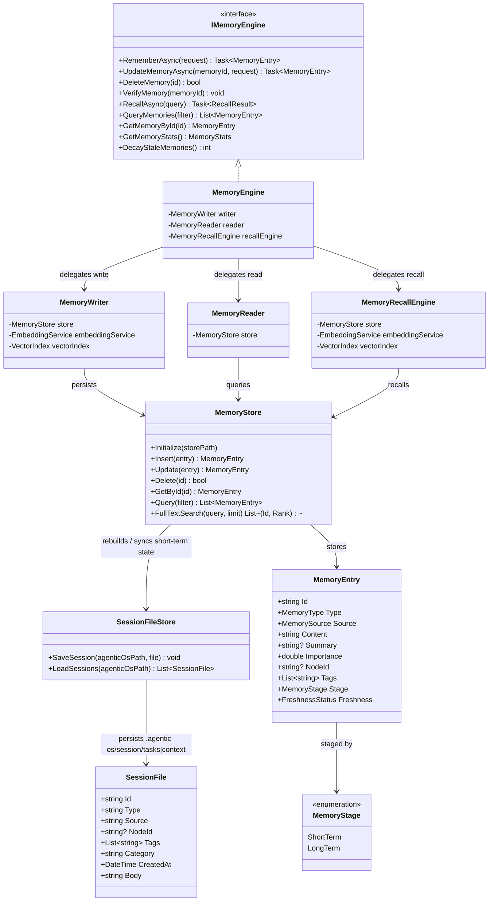

# Dna.Knowledge.Memory 类图

> 状态：目标重构类图
> 最后更新：2026-04-03
> 适用范围：`src/Dna.Knowledge/Memory`

## 目标类图

## 说明

- `ShortTerm` 记忆会同步到 `.agentic-os/session/tasks|context`。
- `LongTerm` 记忆会同步到 `.agentic-os/memory/*`。
- `MemoryStore` 启动时会同时从 `memory` 和 `session` 两套文件协议重建统一内存视图。
- `Memory` 不承担拓扑定义，也不承担模块知识最终落库；这些职责继续归 `TopoGraph` / `Governance`。
