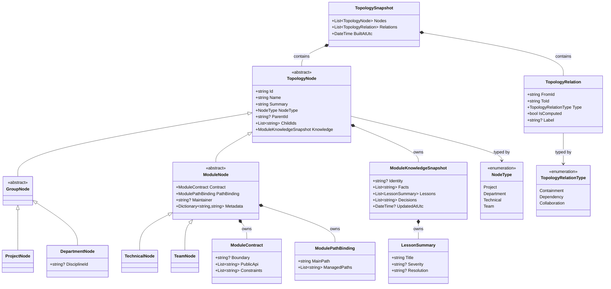

# Dna.Knowledge.TopoGraph 类图

> 状态：目标重构类图
> 最后更新：2026-04-02
> 适用范围：`src/Dna.Knowledge/TopoGraph`

本文档只负责描述 `TopoGraph` 的目标领域类图，不描述完整架构背景。

## 目标类图

下面这张类图不是“当前代码现状图”，而是 `TopoGraph` 接下来重构要收敛到的目标领域类图。

它表达的是：

- 节点抽象怎么分层
- 四类核心节点如何继承
- 模块的路径、契约、关系和模块知识如何拆开
- 为什么最终知识应留在 `TopoGraph`，而不是继续留在 `MemoryStore`

## 类图说明

- `TopologyNode`
  - 是统一节点抽象
  - 只保留所有节点都必须拥有的公共属性
  - 同时拥有按模块组织的知识快照
- `GroupNode`
  - 只承接分组、归属、导航语义
  - 不承接技术依赖能力
- `ModuleNode`
  - 只承接真正可落地的能力模块或业务模块语义
  - 契约、路径、维护信息都应挂在这里
- `ProjectNode / DepartmentNode / TechnicalNode / TeamNode`
  - 是四类正式节点的最终落地类型
- `ModuleKnowledgeSnapshot`
  - 表达该模块沉淀后的最终知识摘要
  - 它来自治理结果，而不是原始记忆全文
- `ModuleContract`
  - 收口模块边界、公开 API 和约束
- `ModulePathBinding`
  - 收口主路径与托管路径
- `TopologyRelation`
  - 统一表达 `Containment / Dependency / Collaboration`

## 对当前实现的直接约束

后续代码重构时，应逐步朝下面这个方向收口：

1. `TopoGraph` 内的知识对象应明确收口为模块知识，而不是继续借用记忆对象语义。
2. `MemoryStore` 中残留的节点知识和图谱知识快照应迁回 `TopoGraph`。
3. 父子关系、依赖关系、协作关系要继续从字段混合表达，演化为显式关系表达。
4. 路径绑定与模块契约要继续从大对象字段中拆出为独立值对象。
5. `Project / Department / Technical / Team` 四类核心节点语义不得再扩散。