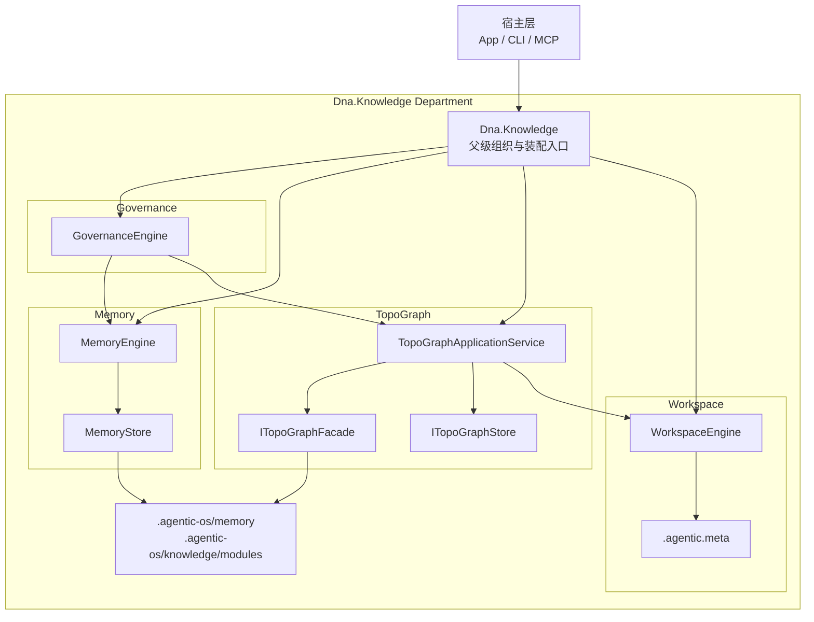
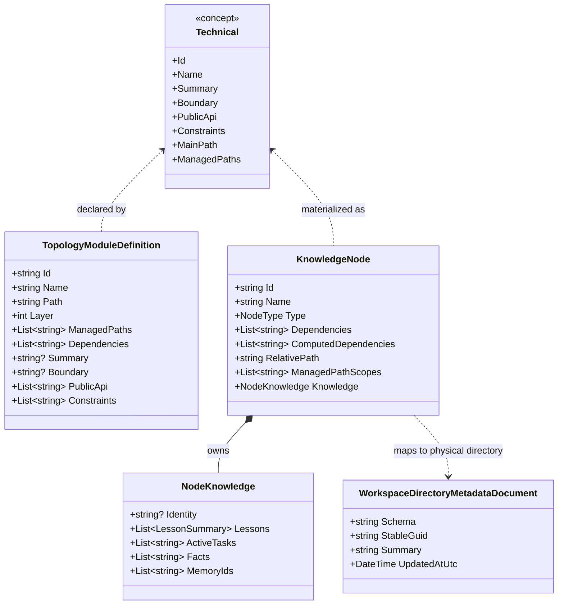
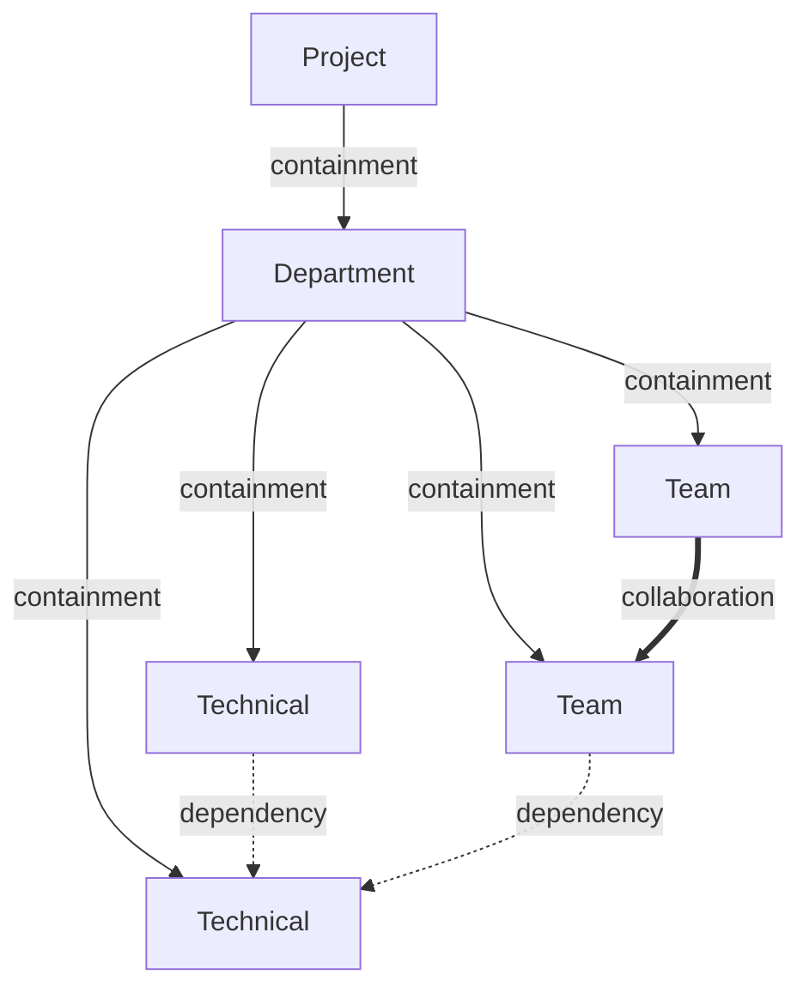

# Dna.Knowledge UML 评审图

> 状态：重构后评审基线
> 最后更新：2026-04-03
> 适用范围：`src/Dna.Knowledge`

本文档只保留知识域的包级与关系级视图。各子模块的细节类图以下沉文档为准。

## 1. 包图

### 包图解读

- `Dna.Knowledge` 只负责组织与装配。
- `Governance -> Memory -> TopoGraph -> Workspace` 仍然是固定单向依赖链。
- `TopoGraphApplicationService` 负责对宿主层暴露统一拓扑能力。
- `ITopoGraphFacade + FileProtocol` 负责定义与快照构建，`ITopoGraphStore` 只保留轻量运行时仓库职责。
- `.agentic-os/memory` 与 `.agentic-os/knowledge/modules` 是新的文件落点。
- `.agentic.meta` 只属于物理目录元数据，不属于知识图谱定义。

## 2. Technical 语义图

### Technical 语义解读

- `TopologyModuleDefinition` 是管理层定义，不再使用旧注册模型命名。
- `KnowledgeNode` 是运行时拓扑视图。
- `NodeKnowledge` 是治理沉淀结果，来源于记忆压缩，不是定义文件本身。

## 3. TopoGraph 关系图

### 关系约束

- `containment` 表达主树归属关系。
- `dependency` 表达技术依赖，允许 `Technical -> Technical` 和 `Team -> Technical`。
- `collaboration` 表达跨工作协作，不用依赖边伪装。

## 4. 当前结论

- 根级 `Dna.Knowledge` 不再维护旧运行时入口。
- 拓扑定义、模块注册和知识落位已经统一到 `TopoGraphApplicationService + ITopoGraphFacade + FileProtocol`。
- 记忆与知识的最终文件位置已经与模块职责对齐。
