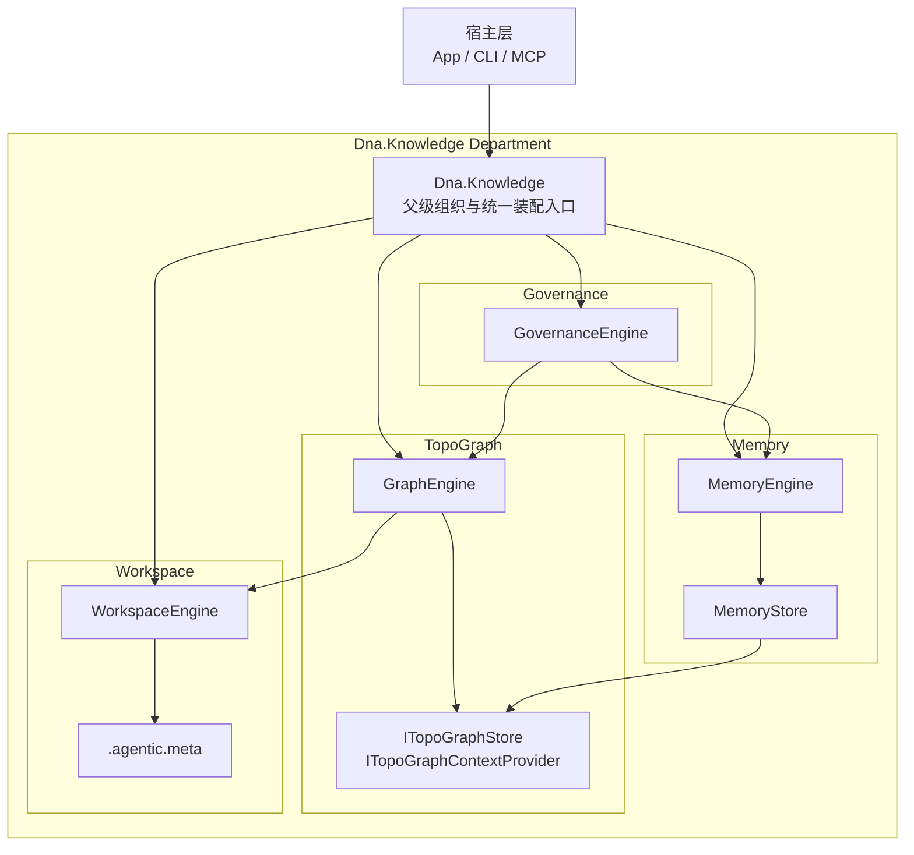
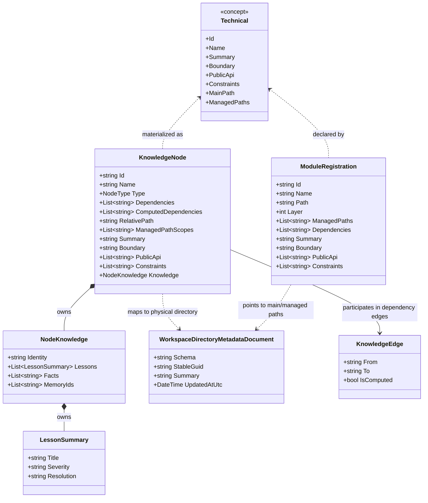
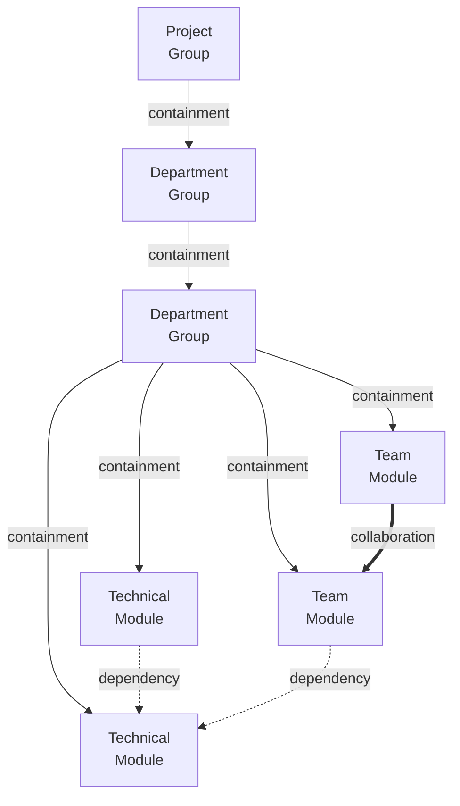

# Dna.Knowledge UML 评审图

> 状态：当前重构基线
> 最后更新：2026-04-02
> 适用范围：`src/Dna.Knowledge`

本文档当前只作为过渡期评审材料保留。

按最新口径：

- `Dna.Knowledge` 是父级 `Department`
- 它本身不维护自己的类图
- 具体类图应下沉到各子模块目录中维护
- 当前请优先以各子模块自己的 `ARCHITECTURE.md` 和 `CLASS-DIAGRAM.md` 为准

后续所有模块完成重构后，这份文档可统一清理或重写。

约束说明：

- 根级 `Dna.Knowledge` 只保留包级与关系级视图
- 不再为根模块绘制细节类图
- 当前唯一保留的细节类图只针对 `Technical` 模块语义

## 1. 包图

下图描述知识域父模块与四个子模块的包级依赖关系，以及它们与宿主层之间的关系。

### 包图解读

- `Dna.Knowledge` 是父级 `Department` 模块，只负责组织与装配，不承载子模块内部实现。
- `Governance -> Memory -> TopoGraph -> Workspace` 是固定的单向依赖链。
- `TopoGraph` 不直接拥有底层存储实现，而是通过 `ITopoGraphStore` / `ITopoGraphContextProvider` 读取图谱相关数据。
- `MemoryStore` 在当前实现中同时承担记忆存储与图谱存储适配角色，这是当前阶段的实现收敛，不代表最终边界应永久耦合。
- `Workspace` 面向真实物理目录工作，`.agentic.meta` 属于目录元数据，而不是模块定义文件。

## 2. Technical 类图

下图只展开 `Technical` 模块相关的核心类关系，不再对根模块做实现级类图展开。

### Technical 类图解读

- `Technical` 在这里是概念类，不是当前代码中已经落地的独立 C# 类。
- `ModuleRegistration` 表达 Technical 的注册声明事实。
- `KnowledgeNode` 表达 Technical 在图谱运行时中的节点形态。
- `NodeKnowledge` 表达挂接在该 Technical 节点上的知识摘要、经验与记忆索引。
- `WorkspaceDirectoryMetadataDocument` 只表达物理目录元数据，不表达 Technical 语义。
- `KnowledgeEdge` 表达 Technical 与其他 Technical 之间的依赖边。

## 3. TopoGraph 建模关系图

下图只关注 `TopoGraph` 的主树、依赖与协作三类关系，用于评审模块建模是否正确。

### 建模关系解读

- `containment`
  - 表达主树父子归属关系
  - `Project` 与 `Department` 是非叶子节点
  - `Technical` 与 `Team` 是叶子节点

- `dependency`
  - 表达技术使用关系
  - 只允许 `Technical -> Technical`
  - 只允许 `Team -> Technical`

- `collaboration`
  - 表达业务协作关系
  - 应主要发生在 `Team` 层
  - 不应用 `dependency` 代替跨业务协作

## 4. UML 关系说明

本系统当前最关键的 UML 关系如下。

### 主树包含关系

在 `TopoGraph` 领域里，主树父子关系应按“包含关系”理解：

- `Project` 包含 `Department`
- `Department` 包含 `Department / Technical / Team`

这是一种领域层面的结构包含，不等同于物理目录包含。

### Technical 的声明与实例化关系

- `ModuleRegistration -> Technical`
  - 表达“声明层”
- `KnowledgeNode -> Technical`
  - 表达“运行时图谱层”

也就是说，`Technical` 不是直接等于某张配置记录，也不是直接等于某个物理目录，而是被多层模型共同承载的语义模块。

### Technical 与物理目录关系

- `Technical` 依赖物理目录承载内容
- 但 `WorkspaceDirectoryMetadataDocument` 只描述目录元数据
- 目录不是 `Technical`
- `Technical` 只是映射到某个主目录及若干托管目录

### Technical 与依赖边关系

- `Technical` 之间允许单向 `Dependency`
- `Team -> Technical` 允许
- `Technical -> Team` 不允许
- `Technical` 不应承担跨业务协作语义

因此在 UML 上：

- `Technical` 与 `KnowledgeEdge` 的关系应按“参与依赖边”理解
- 不应把 `Technical` 画成业务协作中心

## 5. 评审关注点

评审这套 UML 时，建议优先关注以下问题：

1. 根级 `Dna.Knowledge` 是否仍然保持父级 `Department` 视角，而没有侵入子模块职责。
2. `Governance -> Memory -> TopoGraph -> Workspace` 的依赖方向是否始终单向。
3. `Workspace` 是否仍只承载物理事实，而没有重新混入模块语义。
4. `TopoGraph` 是否严格维持 `Project / Department / Technical / Team` 四类核心节点语义。
5. `Team` 是否被错误建模成可复用公共能力模块。
6. `Technical` 是否始终保持高内聚、单一职责、单向依赖。

## 6. 当前结论

这套 UML 图表达的不是“代码目录结构图”，而是当前知识域的正式架构基线：

- 父模块是 `Dna.Knowledge`
- 子模块是 `Workspace / TopoGraph / Memory / Governance`
- 细节类图当前只展开 `Technical`
- `TopoGraph` 内部仍以 `Project / Department / Technical / Team` 建模
- 主树、依赖、协作是三种不同关系
- 物理目录事实与模块语义严格分层

后续 `TopoGraph` 与知识域重构，应以本图和各模块架构文档共同作为评审依据。
