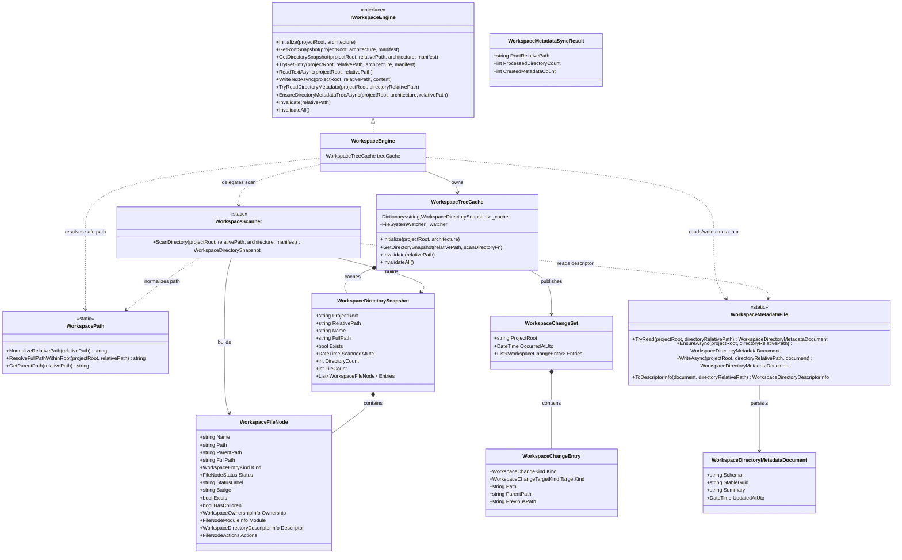

# Dna.Knowledge.Workspace 类图

> 状态：目标重构类图
> 最后更新：2026-04-02
> 适用范围：`src/Dna.Knowledge/Workspace`

本文档只负责描述 `Workspace` 的目标类图，不展开整个知识域的架构背景。

## 模块定位

按照当前最新建模口径，`Workspace` 在 `Dna.Knowledge` 这个父级 `Department` 中，应视为一个 `TechnicalNode`：

- 它不是 `Group`
- 它不是业务 `Team`
- 它是稳定、可复用、单一职责的底层技术服务模块
- 它向 `TopoGraph`、`Memory`、`Governance` 提供统一的工作区事实能力

一句话：

> `Workspace` 是知识域里的“物理工作区事实引擎”这一 `TechnicalNode`。

## 目标类图

下面这张类图不是“当前代码现状逐文件贴图”，而是 `Workspace` 接下来重构要收敛到的目标模块类图。

它表达的是：

- 引擎层、扫描层、缓存层、路径层、元数据层如何分工
- 哪些对象属于稳定领域模型
- 哪些对象是内部技术支撑件

## 类图说明

- `IWorkspaceEngine`
  - 是 `Workspace` 对上层暴露的稳定服务接口
  - 上层应优先依赖它，而不是直接依赖扫描器或缓存器
- `WorkspaceEngine`
  - 是模块门面
  - 负责把缓存、扫描、路径、安全 IO、元数据能力统一组织起来
- `WorkspaceTreeCache`
  - 负责快照缓存、失效与文件监听
  - 不直接承担目录语义解释
- `WorkspaceScanner`
  - 负责把真实目录扫描成稳定的结构化快照
  - 它是事实提取器，不是知识图解释器
- `WorkspacePath`
  - 负责路径归一化与根目录边界保护
  - 它是整个 `Workspace` 安全边界的关键支撑件
- `WorkspaceMetadataFile`
  - 负责 `.agentic.meta` 的读写与描述投影
  - 它只处理目录元数据，不处理模块定义
- `WorkspaceDirectorySnapshot`
  - 表示某个目录的一次稳定扫描结果
- `WorkspaceFileNode`
  - 表示单个工作区文件或目录条目
  - 它承载的是“工作区事实 + 少量工作区解释信息”
- `WorkspaceDirectoryMetadataDocument`
  - 是目录级侧车元数据
  - 它不等于模块定义
- `WorkspaceChangeSet`
  - 是工作区变更事件批次
  - 供上层模块进行失效、刷新和后续治理

## 对当前实现的直接约束

后续代码重构时，应逐步朝下面这个方向收敛：

1. `WorkspaceEngine` 继续保持门面角色，不把扫描、缓存、路径、元数据逻辑重新揉成一个超大类。
2. `WorkspaceScanner` 继续只负责事实提取，不承接 `TopoGraph` 的模块语义解释责任。
3. `WorkspaceDirectoryMetadataDocument` 保持极简，不回退成模块定义文件。
4. `WorkspaceFileNode` 可以继续精简，但要保留“事实优先”的设计原则。
5. 所有路径读写能力都必须继续通过 `WorkspacePath` 保证根目录边界安全。
