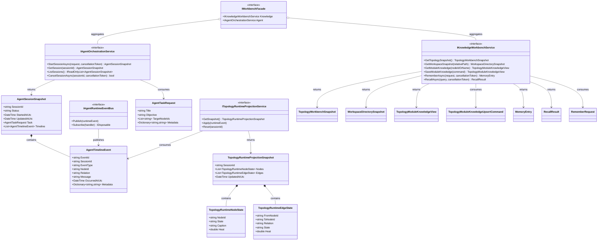

# Dna.Workbench 类图

> 状态：第一阶段目标类图
> 最后更新：2026-04-04
> 适用范围：`src/Dna.Workbench`

本文档只描述 `Dna.Workbench` 作为应用层模块的目标类图，不展开 `Dna.Knowledge` 内部实现细节。

## 模块定位

`Dna.Workbench` 是位于 `App` 与 `Dna.Knowledge` 之间的应用层 `Technical` 模块。

它的目标不是重新实现知识域，而是：

- 定义稳定应用服务接口
- 统一桌面端与外部 Agent 的用例编排
- 定义 Agent 运行时会话和事件模型
- 定义拓扑图实时投影的上层接口

## 目标类图

## 类图说明

- `IWorkbenchFacade`
  - 应用层总门面
  - 给桌面端或适配层提供一个统一入口
- `IKnowledgeWorkbenchService`
  - 负责高层知识用例
  - 依赖 `Dna.Knowledge`，但不暴露底层引擎组合细节
- `IAgentOrchestrationService`
  - 负责任务会话生命周期
  - 是后续 Agent 编排系统的主入口
- `IAgentRuntimeEventBus`
  - 负责统一运行时事件流
  - 内置 Agent 与外部 Agent 都应往这里发事件
- `ITopologyRuntimeProjectionService`
  - 负责把运行时事件变成拓扑图可直接消费的实时状态

## 第一阶段实现约束

后续开发时应遵守：

1. `App` 不要直接依赖 `Dna.Knowledge` 继续新增应用层编排逻辑
2. 新增知识用例优先落到 `IKnowledgeWorkbenchService`
3. 新增 Agent 流程优先落到 `IAgentOrchestrationService`
4. 拓扑实时状态优先围绕 `AgentTimelineEvent` 和 `TopologyRuntimeProjectionSnapshot` 建模
5. HTTP / MCP / CLI 只做适配，不承载真实业务编排
