# Dna.Workbench 类图

> 状态：目标类图（按 2026-04-04 架构决策收口）
> 最后更新：2026-04-04
> 适用范围：`src/Dna.Workbench`

本文档描述 `Dna.Workbench` 的长期稳定边界。  
当前代码中真正属于长期边界的，是 `Knowledge`、`Runtime` 与 `Tooling` 三个能力面。

## 模块定位

`Dna.Workbench` 是位于 `App` / `Dna.Agent` 与 `Dna.Knowledge` 之间的应用服务模块。

它的目标不是管理任务执行过程，而是统一提供：

- 项目知识能力
- 运行时观测能力
- 后续统一工具能力入口

## 目标类图

```mermaid
classDiagram
    class IWorkbenchFacade {
        <<interface>>
        +IKnowledgeWorkbenchService Knowledge
        +IWorkbenchToolService Tools
        +IWorkbenchRuntimeService Runtime
    }

    class IKnowledgeWorkbenchService {
        <<interface>>
        +GetTopologySnapshot() TopologyWorkbenchSnapshot
        +GetWorkspaceSnapshot(relativePath) WorkspaceDirectorySnapshot
        +GetModuleKnowledge(nodeIdOrName) TopologyModuleKnowledgeView
        +SaveModuleKnowledge(command) TopologyModuleKnowledgeView
        +RememberAsync(request, cancellationToken) MemoryEntry
        +RecallAsync(query, cancellationToken) RecallResult
    }

    class IWorkbenchToolService {
        <<interface>>
        +ListTools() IReadOnlyList~WorkbenchToolDescriptor~
        +FindTool(name) WorkbenchToolDescriptor
        +InvokeAsync(request, cancellationToken) WorkbenchToolInvocationResult
    }

    class IWorkbenchRuntimeService {
        <<interface>>
        +Publish(runtimeEvent)
        +GetProjectionSnapshot() TopologyRuntimeProjectionSnapshot
        +ResetProjection(sessionId)
    }

    class WorkbenchToolDescriptor {
        +string Name
        +string Group
        +string Description
        +bool ReadOnly
        +IReadOnlyList~WorkbenchToolParameterDescriptor~ Parameters
    }

    class WorkbenchToolParameterDescriptor {
        +string Name
        +string Type
        +bool Required
        +string Description
    }

    class WorkbenchToolInvocationRequest {
        +string Name
        +JsonElement Arguments
        +WorkbenchToolInvocationContext Context
    }

    class WorkbenchToolInvocationContext {
        +string SourceKind
        +string SourceId
        +string SessionId
        +string WorkspaceRoot
        +Dictionary~string,string~ Metadata
    }

    class WorkbenchToolInvocationResult {
        +string ToolName
        +bool Success
        +JsonElement Payload
        +string Error
        +DateTime ExecutedAtUtc
    }

    class WorkbenchRuntimeEvent {
        +string EventId
        +string SessionId
        +string SourceKind
        +string SourceId
        +string EventType
        +string NodeId
        +string Relation
        +string Message
        +DateTime OccurredAtUtc
        +Dictionary~string,string~ Metadata
    }

    class TopologyRuntimeProjectionSnapshot {
        +string SessionId
        +List~TopologyRuntimeNodeState~ Nodes
        +List~TopologyRuntimeEdgeState~ Edges
        +DateTime UpdatedAtUtc
    }

    class TopologyRuntimeNodeState {
        +string NodeId
        +string State
        +string Caption
        +double Heat
    }

    class TopologyRuntimeEdgeState {
        +string FromNodeId
        +string ToNodeId
        +string Relation
        +string State
        +double Heat
    }

    class TopologyWorkbenchSnapshot
    class WorkspaceDirectorySnapshot
    class TopologyModuleKnowledgeView
    class TopologyModuleKnowledgeUpsertCommand
    class MemoryEntry
    class RecallResult
    class RememberRequest

    IWorkbenchFacade o-- IKnowledgeWorkbenchService : aggregates
    IWorkbenchFacade o-- IWorkbenchToolService : aggregates
    IWorkbenchFacade o-- IWorkbenchRuntimeService : aggregates

    IKnowledgeWorkbenchService --> TopologyWorkbenchSnapshot : returns
    IKnowledgeWorkbenchService --> WorkspaceDirectorySnapshot : returns
    IKnowledgeWorkbenchService --> TopologyModuleKnowledgeView : returns
    IKnowledgeWorkbenchService --> TopologyModuleKnowledgeUpsertCommand : consumes
    IKnowledgeWorkbenchService --> MemoryEntry : returns
    IKnowledgeWorkbenchService --> RecallResult : returns
    IKnowledgeWorkbenchService --> RememberRequest : consumes

    IWorkbenchToolService --> WorkbenchToolDescriptor : returns
    IWorkbenchToolService --> WorkbenchToolInvocationRequest : consumes
    IWorkbenchToolService --> WorkbenchToolInvocationResult : returns
    WorkbenchToolDescriptor *-- WorkbenchToolParameterDescriptor : contains
    WorkbenchToolInvocationRequest o-- WorkbenchToolInvocationContext : contains

    IWorkbenchRuntimeService --> WorkbenchRuntimeEvent : consumes
    IWorkbenchRuntimeService --> TopologyRuntimeProjectionSnapshot : returns
    TopologyRuntimeProjectionSnapshot *-- TopologyRuntimeNodeState : contains
    TopologyRuntimeProjectionSnapshot *-- TopologyRuntimeEdgeState : contains
```

## 类图说明

- `IWorkbenchFacade`
  - Workbench 总入口
  - 给桌面宿主、内置 Agent、CLI、MCP 提供统一能力面
- `IKnowledgeWorkbenchService`
  - 封装工作区、拓扑图、模块知识、记忆等项目能力
  - 对上提供稳定用例，对下依赖 `Dna.Knowledge`
- `IWorkbenchToolService`
  - 把 Workbench 能力整理成统一工具目录与调用入口
  - 供内置 Agent、MCP、CLI 逐步收敛到同一套能力语义
- `IWorkbenchRuntimeService`
  - 接收任意 Agent 的运行时事件
  - 把事件投影成拓扑图可消费的实时状态
- `WorkbenchRuntimeEvent`
  - 不表达“如何规划任务”，只表达“发生了什么运行事件”
  - 适用于内置 Agent 与外置 Agent 的统一观测模型

## 与 Dna.Agent 的边界

下列职责不属于 `Dna.Workbench`，而属于 `Dna.Agent`：

- 启动任务会话
- 任务计划生成
- 步骤推进
- 工具调用策略
- 大模型响应循环
- 失败恢复与重试

当前已经迁出的典型内容包括：

- `IAgentOrchestrationService`
- `AgentSessionSnapshot`
- `AgentTaskRequest`

仍留在 `Dna.Workbench` 下的 `Agent/Pipeline/*` 仅视为历史遗留，不代表长期边界。

## 第一阶段实现约束

后续开发时应遵守：

1. `App` 不要继续新增直接拼装 `Dna.Knowledge` 的应用层逻辑
2. 新增知识用例优先落到 `IKnowledgeWorkbenchService`
3. 新增统一工具能力优先落到 `IWorkbenchToolService`
4. 新增运行时观测能力优先落到 `IWorkbenchRuntimeService`
5. 不再把新的任务编排职责加进 `Dna.Workbench`
6. HTTP / MCP / CLI 只做适配，不承载真正的知识编排逻辑
