# Dna.Workbench 类图

> 状态：目标类图（按 2026-04-04 架构决策收口）
> 最后更新：2026-04-04
> 适用范围：`src/Dna.Workbench`

本文档描述 `Dna.Workbench` 的长期稳定边界。  
当前长期边界应收口为 `Knowledge`、`Governance`、`Tasks`、`Tooling`、`Runtime` 五个能力面。

## 模块定位

`Dna.Workbench` 是位于 `App` / `Dna.Agent` / `Dna.ExternalAgent` 与 `Dna.Knowledge` 之间的应用服务模块。

它的目标不是管理任务执行过程，而是统一提供：

- 项目知识能力
- 治理范围与演化能力
- 需求拆解能力
- 任务桥接能力
- 运行时观测能力
- 统一工具能力入口

## 目标类图

```mermaid
classDiagram
    class IWorkbenchFacade {
        <<interface>>
        +IKnowledgeWorkbenchService Knowledge
        +IWorkbenchGovernanceService Governance
        +IWorkbenchTaskService Tasks
        +IWorkbenchToolService Tools
        +IWorkbenchRuntimeService Runtime
    }

    class IKnowledgeWorkbenchService {
        <<interface>>
        +GetTopologySnapshot() TopologyWorkbenchSnapshot
        +GetWorkspaceSnapshot(relativePath) WorkspaceDirectorySnapshot
        +GetModuleKnowledge(nodeIdOrName) TopologyModuleKnowledgeView
        +SaveModuleKnowledge(command) TopologyModuleKnowledgeView
        +RememberAsync(request, cancellationToken) MemoryEntry
        +RecallAsync(query, cancellationToken) RecallResult
    }

    class IWorkbenchTaskService {
        <<interface>>
        +ResolveRequirementAsync(request, cancellationToken) WorkbenchRequirementResolutionResult
        +StartTaskAsync(request, cancellationToken) WorkbenchTaskStartResult
        +EndTaskAsync(result, cancellationToken)
    }

    class IWorkbenchGovernanceService {
        <<interface>>
        +ResolveGovernanceAsync(request, cancellationToken) WorkbenchGovernanceResolutionResult
    }

    class IWorkbenchToolService {
        <<interface>>
        +ListTools() IReadOnlyList~WorkbenchToolDescriptor~
        +FindTool(name) WorkbenchToolDescriptor
        +InvokeAsync(request, cancellationToken) WorkbenchToolInvocationResult
    }

    class IWorkbenchRuntimeService {
        <<interface>>
        +Publish(runtimeEvent)
        +GetProjectionSnapshot() TopologyRuntimeProjectionSnapshot
        +ResetProjection(sessionId)
    }

    class WorkbenchRequirementResolutionRequest {
        +string RequirementId
        +string Objective
        +string SourceKind
        +string SourceId
        +string CurrentModuleId
        +Dictionary~string,string~ Metadata
    }

    class WorkbenchRequirementResolutionResult {
        +string RequirementId
        +string Summary
        +IReadOnlyList~WorkbenchTaskCandidate~ TaskCandidates
    }

    class WorkbenchGovernanceRequest {
        +string RequestId
        +string ScopeKind
        +string RootModuleId
        +string Objective
        +string SourceKind
        +string SourceId
        +Dictionary~string,string~ Metadata
    }

    class WorkbenchGovernanceResolutionResult {
        +string RequestId
        +string ScopeKind
        +string Summary
        +WorkbenchGovernanceModuleTree GovernanceTree
    }

    class WorkbenchGovernanceModuleTree {
        +string RootModuleId
        +string RootModuleName
        +IReadOnlyList~WorkbenchGovernanceModuleNode~ Nodes
    }

    class WorkbenchGovernanceModuleNode {
        +string ModuleId
        +string ModuleName
        +string ParentModuleId
        +string KnowledgeStatus
        +IReadOnlyList~string~ ManagedPaths
        +IReadOnlyList~string~ RelatedMemoryIds
    }

    class WorkbenchTaskCandidate {
        +string CandidateId
        +string TargetModuleId
        +string TargetModuleName
        +string Objective
        +string DesiredOutcome
        +IReadOnlyList~string~ DependencyModuleIds
        +IReadOnlyList~string~ CollaborationModuleIds
        +IReadOnlyList~string~ PredecessorTaskIds
    }

    class WorkbenchTaskStartRequest {
        +string TaskId
        +string RequirementId
        +string GovernanceRequestId
        +string TargetModuleId
        +string Objective
        +string DesiredOutcome
        +string TaskKind
        +string AgentSessionId
        +string SourceKind
        +string SourceId
        +IReadOnlyList~string~ PredecessorTaskIds
        +Dictionary~string,string~ Metadata
    }

    class WorkbenchTaskStartResult {
        +bool Success
        +string Status
        +WorkbenchTaskContext Context
        +string ConflictModuleId
        +IReadOnlyList~string~ ConflictingTaskIds
        +string FailureReason
    }

    class WorkbenchTaskContext {
        +string TaskId
        +string TargetModuleId
        +string TargetModuleName
        +WorkbenchAgentBinding Binding
        +WorkbenchModuleLease ModuleLease
        +WorkspaceOperationScope OperationScope
        +TopologyModuleKnowledgeView ModuleKnowledge
        +RecallResult RelevantMemory
        +IReadOnlyList~string~ Constraints
        +IReadOnlyList~string~ BlockingDependencies
    }

    class WorkbenchAgentBinding {
        +string SourceKind
        +string SourceId
        +string AgentSessionId
        +DateTime BoundAtUtc
    }

    class WorkbenchModuleLease {
        +string LeaseId
        +string TaskId
        +string ModuleId
        +DateTime AcquiredAtUtc
    }

    class WorkspaceOperationScope {
        +string ProjectRoot
        +string ModuleRoot
        +IReadOnlyList~string~ ManagedPaths
        +IReadOnlyList~string~ WritablePaths
    }

    class WorkbenchTaskResult {
        +string TaskId
        +string AgentSessionId
        +string Status
        +string Summary
        +string DecisionNotes
        +string LessonsLearned
        +string FailureReason
        +IReadOnlyList~string~ BlockingDependencies
        +IReadOnlyList~string~ MemoryIds
        +DateTime CompletedAtUtc
    }

    class WorkbenchToolDescriptor {
        +string Name
        +string Group
        +string Description
        +bool ReadOnly
        +IReadOnlyList~WorkbenchToolParameterDescriptor~ Parameters
    }

    class WorkbenchToolParameterDescriptor {
        +string Name
        +string Type
        +bool Required
        +string Description
    }

    class WorkbenchToolInvocationRequest {
        +string Name
        +JsonElement Arguments
        +WorkbenchToolInvocationContext Context
    }

    class WorkbenchToolInvocationContext {
        +string SourceKind
        +string SourceId
        +string SessionId
        +string WorkspaceRoot
        +Dictionary~string,string~ Metadata
    }

    class WorkbenchToolInvocationResult {
        +string ToolName
        +bool Success
        +JsonElement Payload
        +string Error
        +DateTime ExecutedAtUtc
    }

    class WorkbenchRuntimeEvent {
        +string EventId
        +string SessionId
        +string SourceKind
        +string SourceId
        +string EventType
        +string NodeId
        +string Relation
        +string Message
        +DateTime OccurredAtUtc
        +Dictionary~string,string~ Metadata
    }

    class TopologyRuntimeProjectionSnapshot {
        +string SessionId
        +List~TopologyRuntimeNodeState~ Nodes
        +List~TopologyRuntimeEdgeState~ Edges
        +DateTime UpdatedAtUtc
    }

    class TopologyRuntimeNodeState {
        +string NodeId
        +string State
        +string Caption
        +double Heat
    }

    class TopologyRuntimeEdgeState {
        +string FromNodeId
        +string ToNodeId
        +string Relation
        +string State
        +double Heat
    }

    class TopologyWorkbenchSnapshot
    class WorkspaceDirectorySnapshot
    class TopologyModuleKnowledgeView
    class TopologyModuleKnowledgeUpsertCommand
    class MemoryEntry
    class RecallResult
    class RememberRequest

    IWorkbenchFacade o-- IKnowledgeWorkbenchService : aggregates
    IWorkbenchFacade o-- IWorkbenchGovernanceService : aggregates
    IWorkbenchFacade o-- IWorkbenchTaskService : aggregates
    IWorkbenchFacade o-- IWorkbenchToolService : aggregates
    IWorkbenchFacade o-- IWorkbenchRuntimeService : aggregates

    IKnowledgeWorkbenchService --> TopologyWorkbenchSnapshot : returns
    IKnowledgeWorkbenchService --> WorkspaceDirectorySnapshot : returns
    IKnowledgeWorkbenchService --> TopologyModuleKnowledgeView : returns
    IKnowledgeWorkbenchService --> TopologyModuleKnowledgeUpsertCommand : consumes
    IKnowledgeWorkbenchService --> MemoryEntry : returns
    IKnowledgeWorkbenchService --> RecallResult : returns
    IKnowledgeWorkbenchService --> RememberRequest : consumes

    IWorkbenchGovernanceService --> WorkbenchGovernanceRequest : consumes
    IWorkbenchGovernanceService --> WorkbenchGovernanceResolutionResult : returns
    WorkbenchGovernanceResolutionResult o-- WorkbenchGovernanceModuleTree : aggregates
    WorkbenchGovernanceModuleTree *-- WorkbenchGovernanceModuleNode : contains

    IWorkbenchTaskService --> WorkbenchRequirementResolutionRequest : consumes
    IWorkbenchTaskService --> WorkbenchRequirementResolutionResult : returns
    IWorkbenchTaskService --> WorkbenchTaskStartRequest : consumes
    IWorkbenchTaskService --> WorkbenchTaskStartResult : returns
    IWorkbenchTaskService --> WorkbenchTaskResult : consumes
    WorkbenchRequirementResolutionResult *-- WorkbenchTaskCandidate : contains
    WorkbenchTaskStartResult o-- WorkbenchTaskContext : aggregates
    WorkbenchTaskContext o-- WorkbenchAgentBinding : aggregates
    WorkbenchTaskContext o-- WorkbenchModuleLease : aggregates
    WorkbenchTaskContext o-- WorkspaceOperationScope : aggregates
    WorkbenchTaskContext o-- TopologyModuleKnowledgeView : aggregates
    WorkbenchTaskContext o-- RecallResult : aggregates

    IWorkbenchToolService --> WorkbenchToolDescriptor : returns
    IWorkbenchToolService --> WorkbenchToolInvocationRequest : consumes
    IWorkbenchToolService --> WorkbenchToolInvocationResult : returns
    WorkbenchToolDescriptor *-- WorkbenchToolParameterDescriptor : contains
    WorkbenchToolInvocationRequest o-- WorkbenchToolInvocationContext : contains

    IWorkbenchRuntimeService --> WorkbenchRuntimeEvent : consumes
    IWorkbenchRuntimeService --> TopologyRuntimeProjectionSnapshot : returns
    TopologyRuntimeProjectionSnapshot *-- TopologyRuntimeNodeState : contains
    TopologyRuntimeProjectionSnapshot *-- TopologyRuntimeEdgeState : contains
```

## 类图说明

- `IWorkbenchFacade`
  - Workbench 总入口
  - 给桌面宿主、内置 Agent、外置 Agent、CLI、MCP 提供统一能力面
- `IKnowledgeWorkbenchService`
  - 封装工作区、拓扑图、模块知识、记忆等项目能力
  - 对上提供稳定用例，对下依赖 `Dna.Knowledge`
- `IWorkbenchGovernanceService`
  - 返回全局或指定模块范围的治理模块树
  - 为 Agent 提供记忆治理、知识压缩、知识演化所需的治理上下文
- `IWorkbenchTaskService`
  - 先辅助 Agent 做需求拆解
  - 再通过 `StartTaskAsync` 提供唯一模块任务上下文
  - 最后通过 `EndTaskAsync` 回收租约并写回结果
  - 自身不负责任务调度，只负责模块锁、上下文封装与冲突保护
- `WorkbenchRequirementResolutionResult`
  - 不是执行结果，而是模块级任务候选集合
  - 供 Agent 自己决定串行、并行和依赖顺序
- `WorkbenchTaskContext`
  - 表达一个单任务真正可见、可操作的完整边界
  - 同时包含模块知识、相关记忆、workspace 边界与租约信息
- `WorkbenchGovernanceModuleTree`
  - 表达一次治理请求可见的模块树范围
  - 供 Agent 自己决定治理顺序和拆分后的治理 task
- `WorkbenchAgentBinding`
  - 表示当前 task 与哪个 agent session 绑定
- `WorkbenchModuleLease`
  - 表示当前 task 对目标模块的唯一占用权
  - 它本质上承担模块锁语义
- `IWorkbenchToolService`
  - 把 Workbench 能力整理成统一工具目录与调用入口
  - 供内置 Agent、外置 Agent、MCP、CLI 收敛到同一套能力语义
- `IWorkbenchRuntimeService`
  - 接收任意 Agent 的运行时事件
  - 把事件投影成拓扑图可消费的实时状态

## 与 Dna.Agent 的边界

下列职责不属于 `Dna.Workbench`，而属于 `Dna.Agent`：

- 把需求拆解结果编排成真正执行顺序
- 决定哪些 task 串行、哪些 task 并行
- 管理多轮模型推理循环
- 决定何时调用哪一个工具
- 失败恢复与重试策略

当前已经迁出的典型内容包括：

- `IAgentOrchestrationService`
- `AgentSessionSnapshot`
- `AgentTaskRequest`

仍留在 `Dna.Workbench` 下的 `Agent/Pipeline/*` 仅视为历史遗留，不代表长期边界。

## 第一阶段实现约束

后续开发时应遵守：

1. `App` 不要继续新增直接拼装 `Dna.Knowledge` 的应用层逻辑
2. 新增知识用例优先落到 `IKnowledgeWorkbenchService`
3. 新增治理范围解析与治理模块树语义优先落到 `IWorkbenchGovernanceService`
4. 新增需求拆解、`startTask`、`endTask` 语义优先落到 `IWorkbenchTaskService`
5. 一个活动 task 只能绑定一个目标模块
6. 同一时刻同一目标模块只能被一个活动 task 占用
7. `endTask` 必须可携带决策、教训、失败原因与阻塞依赖
8. 模块互斥的目标是降低多 Agent 并发修改同一工作区模块的合并风险，而不是替 Agent 编排顺序
9. 新增统一工具能力优先落到 `IWorkbenchToolService`
10. 新增运行时观测能力优先落到 `IWorkbenchRuntimeService`
11. 不再把新的任务编排职责加进 `Dna.Workbench`
12. HTTP / MCP / CLI 只做适配，不承载真正的项目编排逻辑
