# Dna.Workbench 类图 (Class Diagram)

> 状态：Active
> 最后更新：2026-04-04
> 说明：本类图描述了 Workbench 作为“带锁受限任务容器”的核心领域模型与服务契约。无论是需求开发还是架构治理，在执行层都统一抽象为标准的 Task。

```mermaid
classDiagram
    %% 核心门面
    class IWorkbenchFacade {
        <<interface>>
        +IKnowledgeWorkbenchService Knowledge
        +IWorkbenchGovernanceService Governance
        +IWorkbenchTaskService Tasks
        +IWorkbenchToolService Tools
        +IWorkbenchRuntimeService Runtime
    }

    %% 任务服务 (统一执行引擎)
    class IWorkbenchTaskService {
        <<interface>>
        +ResolveRequirementSupport(RequirementSupportRequest req) TaskCandidate[]
        +StartTask(TaskRequest req) TaskStartResponse
        +EndTask(TaskResult result) TaskEndResponse
        +ListActiveTasks() ActiveTaskSnapshot[]
        +ListCompletedTasks(limit) CompletedTaskSnapshot[]
    }

    %% 治理服务 (仅负责范围解析)
    class IWorkbenchGovernanceService {
        <<interface>>
        +ResolveGovernance(GovernanceRequest req) GovernanceContext
    }

    %% 内部核心引擎
    class IModuleLockManager {
        <<interface>>
        +TryAcquireLock(string moduleId, string taskId, string agentId) bool
        +ReleaseLock(string moduleId) void
        +GetActiveLocks() IReadOnlyList~ModuleLock~
    }

    class ITaskContextBuilder {
        <<interface>>
        +BuildContext(string moduleId, TaskRequest req) TaskContext
    }

    %% 领域模型 - Tasks
    class TaskType {
        <<enumeration>>
        Requirement
        Governance
    }

    class TaskRequest {
        +string ModuleId
        +string AgentId
        +TaskType Type
        +string Goal
        +string[] PrerequisiteTaskIds
    }

    class TaskContext {
        +string TaskId
        +string ModuleId
        +TaskType Type
        +ModuleDna TargetModule
        +Contract[] VisibleContracts
        +TaskRelation[] OutgoingRelations
        +TaskRelation[] IncomingRelations
        +TaskCrossWorkContext[] CollaborationContexts
        +Memory[] RelevantMemories
        +TaskDependencyStatus[] PrerequisiteStatuses
        +string WorkspaceBoundary
    }

    class WorkspaceScope {
        +PathScope[] ReadableScopes
        +PathScope[] WritableScopes
        +ContractScope[] ContractOnlyScopes
    }

    class TaskResult {
        +string TaskId
        +bool IsSuccess
        +string[] Decisions
        +string[] Lessons
        +string[] PendingDependencies
    }

    class TaskCompletion {
        +string TaskId
        +string ModuleId
        +bool LockReleased
        +string[] PendingDependencies
    }

    class TaskStartResponse {
        +bool Success
        +TaskContext? Context
        +TaskOperationError? Error
    }

    class TaskEndResponse {
        +bool Success
        +TaskCompletion? Completion
        +TaskOperationError? Error
    }

    class TaskOperationError {
        +TaskErrorKind Kind
        +string Message
        +string? ModuleIdOrName
        +string? ConflictingTaskId
        +string? ConflictingAgentId
    }

    class TaskRelation {
        +string FromId
        +string FromName
        +string ToId
        +string ToName
        +RelationType Type
        +bool IsComputed
        +string? Label
    }

    class TaskCrossWorkContext {
        +string CrossWorkId
        +string CrossWorkName
        +string? Description
        +string? Feature
        +string? TargetRole
    }

    class ActiveTaskSnapshot {
        +string TaskId
        +string ModuleId
        +string AgentId
        +TaskType Type
        +string Goal
        +DateTime StartedAtUtc
    }

    class CompletedTaskSnapshot {
        +string TaskId
        +string ModuleId
        +TaskType Type
        +TaskOutcome Outcome
        +string Summary
        +DateTime CompletedAtUtc
    }

    %% 领域模型 - Governance
    class GovernanceContext {
        +string ScopeId
        +ModuleNode[] ModuleTree
        +Memory[] PendingMemories
        +string[] GovernanceSuggestions
    }

    %% 依赖关系
    IWorkbenchFacade --> IWorkbenchTaskService : 聚合
    IWorkbenchFacade --> IWorkbenchGovernanceService : 聚合
    
    IWorkbenchTaskService ..> TaskRequest : 消费
    IWorkbenchTaskService ..> TaskContext : 生产
    IWorkbenchTaskService ..> TaskResult : 消费
    
    IWorkbenchGovernanceService ..> GovernanceContext : 生产

    IWorkbenchTaskService --> IModuleLockManager : 依赖 (并发控制)
    IWorkbenchTaskService --> ITaskContextBuilder : 依赖 (视界裁剪)
```

## 核心设计说明

1. **统一任务模型 (Unified Task Model)**：无论是正常的业务需求（Requirement）还是周期性的架构治理（Governance），在执行阶段都是一个标准的 `TaskRequest`，都要经过 `StartTask` -> `Lock` -> `EndTask` -> `Unlock` 的标准生命周期。
2. **IWorkbenchTaskService**: 负责需求收口辅助（`ResolveRequirementSupport`）和单任务生命周期管理；其中收口辅助只做确定性候选匹配，不做大模型推理，并向上层提供活动任务、完成任务、前置依赖状态以及显式关系视图。
3. **IWorkbenchGovernanceService**: 仅负责范围解析，返回治理范围的上下文（`ResolveGovernance`），由 Agent 自己决定后续治理计划与任务链。
4. **IModuleLockManager**: 内存级并发控制器，确保同一时间只有一个 Task 能修改特定模块。
5. **ITaskContextBuilder**: 上下文组装引擎，负责基于 MCDP 协议进行“视界裁剪（Horizon Filtering）”。对于 Governance 类型的任务，可能会在上下文中额外注入更多架构约束和待处理的 Memory。