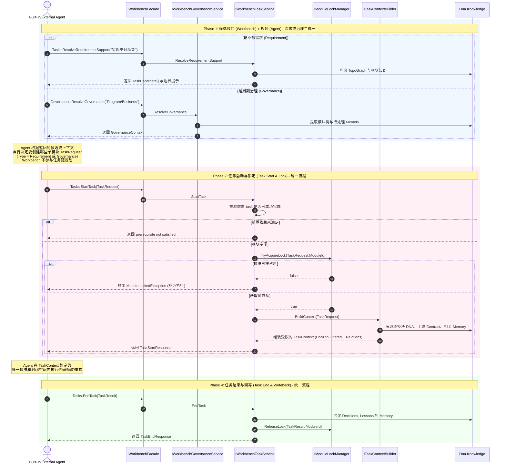

# Dna.Workbench 运行流程图 (Runtime Flow)

> 状态：Active
> 最后更新：2026-04-04
> 说明：描述 Agent 与 Workbench 交互的标准任务闭环。无论是需求开发还是周期治理，在执行阶段都走完全相同的 Start -> Lock -> End 流程。

## 1. 统一任务闭环 (Unified Task Lifecycle)

无论是 `Requirement` 还是 `Governance`，区别仅在于前期的“候选收口 / Agent 规划”阶段，一旦进入执行阶段，全部收口为标准的 `TaskRequest`。

## 核心机制说明

1. **统一的执行漏斗**：无论 Agent 想要做什么（开发新功能、修 Bug、重构、清理依赖），最终都必须构造一个 `TaskRequest` 并调用 `StartTask`。
2. **Fail Fast 机制**：如果多个 Agent（或同一个 Agent 的并发线程）尝试 `StartTask` 同一个模块，`LockMgr` 会直接拒绝后续请求，强制 Agent 重新编排或等待。
3. **视界裁剪 (Horizon Filtering)**：`ITaskContextBuilder` 是关键，它不会把整个工作区的代码给 Agent，而是只给目标模块的完整实现，以及依赖模块的 `Contract`（契约）。如果是 `Governance` 类型的任务，Context 中可能会额外强调架构约束。
4. **闭环强制性**：Agent 必须调用 `EndTask` 才能释放锁，并且必须在 `TaskResult` 中提交决策和教训，强制完成知识沉淀。
5. **可协作性**：Workbench 维护活动任务与最近完成任务摘要，供上层 Agent Runtime、外置 Agent 和 UI 做恢复、依赖校验与状态展示。